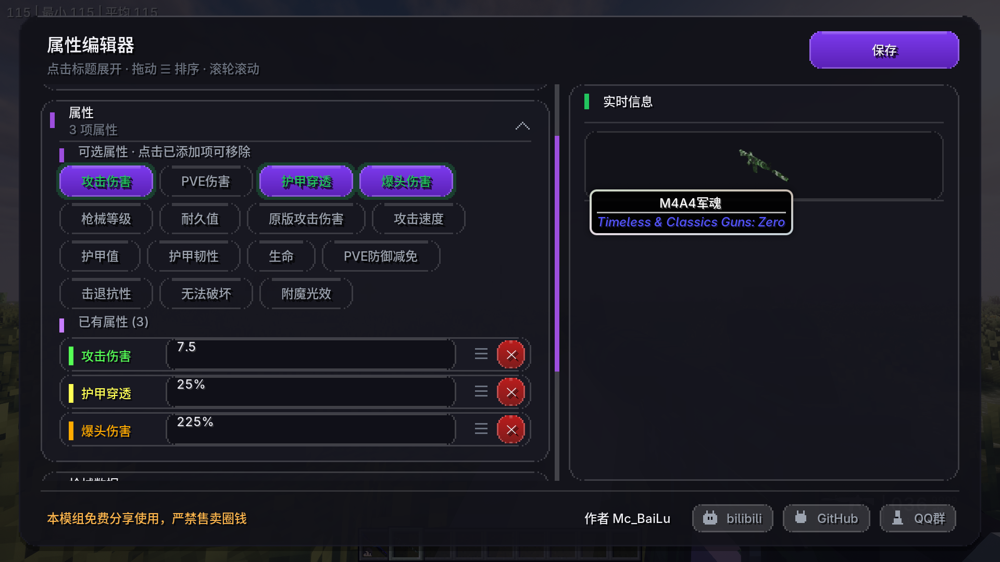
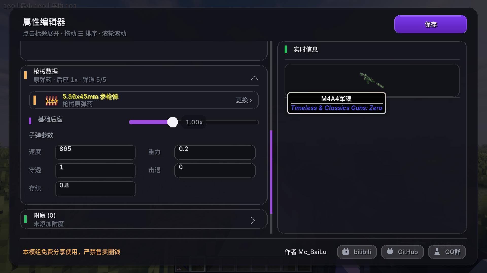
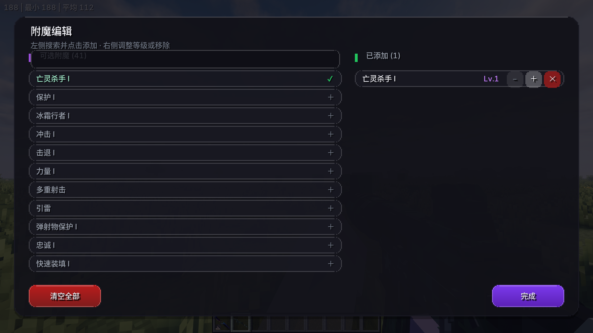
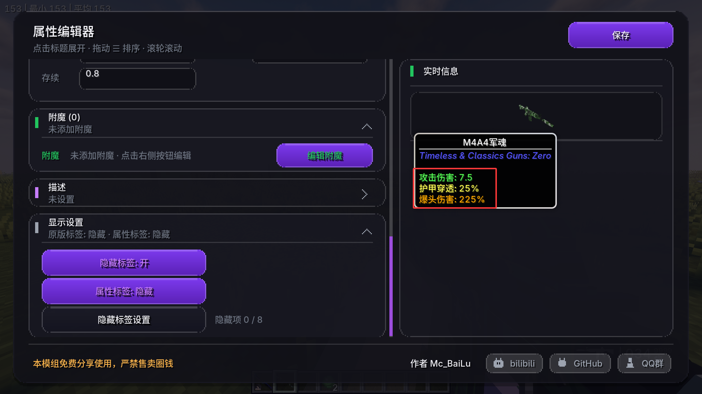
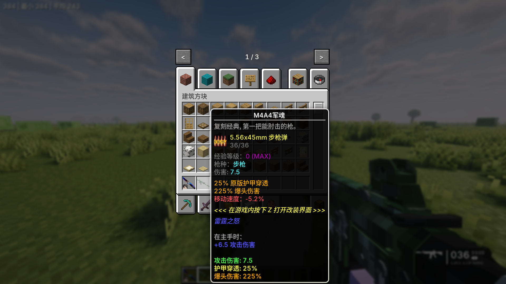

<div align="center">


# TaczAttribute Data Editor

**面向 Minecraft 1.20.1 Forge 的可视化物品属性编辑器 · TACZ 枪械数据修改**

在游戏里按一个键，就能给手上的物品改属性、改附魔、改描述、改枪械弹药与后座 —— 全部实时预览，所见即所得。

[](https://www.minecraft.net/)
[](https://files.minecraftforge.net/)
[](https://github.com/MCModderAnchor/TACZ)
[](#更新日志)
[](#许可与声明)

</div>

---

## 目录

- [这是什么](#这是什么)
- [界面预览](#界面预览)
- [功能总览](#功能总览)
- [快速开始](#快速开始)
- [功能详解](#功能详解)
  - [属性卡片](#1-属性卡片)
  - [枪械数据卡片](#2-枪械数据卡片仅-tacz-枪械)
  - [附魔 / 描述 / 显示设置](#3-附魔--描述--显示设置)
  - [实时信息预览](#4-实时信息预览)
- [支持的属性一览](#支持的属性一览)
- [权限模型](#权限模型)
- [从源码构建](#从源码构建)
- [项目结构](#项目结构)
- [工作原理](#工作原理)
- [已知限制](#已知限制)
- [常见问题](#常见问题)
- [更新日志](#更新日志)
- [许可与声明](#许可与声明)

---

## 这是什么

**TaczAttribute Data Editor**（模组 ID `tacz_attribute_data`）是一个纯客户端的**物品编辑 UI** + 一套**运行时数据桥接**。

它把「改一件物品的属性」这件事从繁琐的 NBT 手改，变成了一个带玻璃拟态风格、有平滑动画的卡片式编辑器：

- **可视化编辑**：属性、附魔、描述、显示开关、枪械数据，各自一张可折叠卡片；
- **实时预览**：右侧实时渲染物品的真实提示框，改一个字立刻见效；
- **真正生效**：不只是写进 NBT 好看 —— 伤害、穿甲、爆头倍率、攻速、护甲等都通过事件与 Mixin 在运行时真正作用于战斗计算；
- **TACZ 深度支持**：可替换枪械主弹药、改写子弹弹道参数、用滑条调整基础后座倍率。

> 设计取向：**只做加法和覆盖，不改动原版与 TACZ 的既有数据**。任何未设置的值都保持原样，物品标签干净、可随时还原。

---

## 界面预览

### 属性编辑（主界面）



左侧是卡片式编辑区（点击标题展开/收起、拖动 `☰` 排序、滚轮滚动），右侧是**实时信息**栏，直接渲染该物品当前的真实提示框。

### 枪械数据（仅 TACZ 枪械显示）



主弹药切换、子弹弹道参数覆盖与基础后座倍率滑条 —— 这张卡片只在编辑 TACZ 枪械时出现。

### 附魔编辑



独立分栏界面：左侧搜索并点击添加，右侧调整等级（`−` / `＋`）或移除。

### 显示设置与实时预览



「显示设置」卡片集中管理提示框开关：隐藏原版/枪械面板、显示或隐藏模组自定义属性行，以及更细粒度的「隐藏标签设置」。

### 游戏内物品提示框效果



---

## 功能总览

| 卡片 | 能做什么 |
| --- | --- |
| **物品信息** | 重命名物品（支持 `§` 传统颜色代码），一键清除自定义名 |
| **属性** | 15 种可编辑属性，点选添加、拖拽排序、单独删除，数值实时校验 |
| **枪械数据** | 仅当编辑的是 TACZ 枪械时出现：主弹药切换、子弹弹道参数、基础后座倍率滑条 |
| **附魔** | 独立编辑界面，搜索 + 等级加减，支持全部已注册附魔 |
| **描述** | 独立编辑界面，多行 Lore，支持颜色代码 |
| **显示设置** | 原版/枪械面板开关、自定义属性行开关、8 项细粒度隐藏标记 + 主手属性段开关 |

---

## 快速开始

### 安装

1. 安装 **Minecraft 1.20.1** 与 **Forge 47.x**；
2. 安装 **TACZ (Timeless and Classics Zero) 1.1.6 或更高版本**（必需前置）；
3. 把 `tacz_attribute_data-1.0.2.jar` 放进 `mods` 文件夹；
4. 启动游戏。

> 可选：同时安装 **LesRaisins Tactical Equipments (lrtactical)**，其近战武器也会获得可编辑的攻击速度/伤害支持。

### 使用

1. 把要编辑的物品拿在**主手**；
2. 按 `U`（默认键位，可在「控制 → 按键绑定」中修改）打开 **属性编辑器**；
3. 展开卡片进行修改，右侧实时预览；
4. 点击右上角 **保存** 写入物品。

---

## 功能详解

### 1. 属性卡片

所有可编辑项以「标签胶囊」形式列出，点击即添加，再次点击已添加项可移除：

- **数值类**：攻击伤害、PVE 伤害、爆头伤害、护甲穿透、护甲值、护甲韧性、生命、击退抗性、耐久值、攻击速度、原版攻击伤害、PVE 防御减免、枪械等级……
- **开关类**：无法破坏、附魔光效；
- **已有属性列表**：按行编辑，左侧 `☰` 拖动可调整显示顺序，右侧 `✕` 删除。

每个属性行都带颜色标识与占位提示，首次打开时会自动用**物品当前的真实数值**预填，不会出现空行。

### 2. 枪械数据卡片（仅 TACZ 枪械）

> 只有当主手物品是 TACZ 枪械时，这张卡片才会出现；其他物品完全看不到它，也不会影响其它卡片的布局高度。

| 区块 | 说明 |
| --- | --- |
| **主弹药** | 点击整行打开弹药选择器（创造栏风格网格 + 搜索框），可为该枪指定任意 TACZ 弹药；换弹、弹药消耗、开火生成的子弹以及枪械提示框都会跟随变化。选「恢复默认」即可还原。 |
| **基础后座** | 滑条调整后座倍率，范围 `0.00x ~ 3.00x`，步进 `0.05`，`1.00x` 即原版；作用于相机后座的真实抖动。 |
| **子弹参数** | 双列数值输入，覆盖该枪生成的子弹弹道：速度、重力、穿透、击退、存续时间；留空即保持原版。 |

### 3. 附魔 / 描述 / 显示设置

- **附魔**：独立分栏界面 —— 左侧搜索并点击添加，右侧调整等级（`−` / `＋`）或移除，支持全部已注册附魔。
- **描述**：独立界面，多行 Lore 编辑，支持 `§` 颜色代码，可新增/删除/排序。
- **显示设置**：
  - **隐藏标签**：隐藏整块原版/枪械提示面板，只保留模组自己的行；
  - **属性标签**：显示/隐藏模组追加的属性行（**默认隐藏**，按需打开）；
  - **隐藏标签设置**：8 项细粒度开关（附魔、自定义属性、无法破坏、可以摧毁、可以放置在、物品信息、染色信息、升级信息）与「主手属性」段开关。

### 4. 实时信息预览

编辑器右侧会用一个**一次性构造的临时物品**、带上你当前的全部编辑，调用游戏原版接口生成真实提示框，因此：

- 颜色、图标、顺序、换行与游戏内完全一致；
- 修改名称/属性/附魔/隐藏开关后立即刷新；
- 长文本会被裁剪到视口内，不会溢出面板。

---

## 支持的属性一览

| 属性 | 说明 | 运行时行为 |
| --- | --- | --- |
| 攻击伤害 | 覆盖武器/枪械的伤害值 | 枪械走 `EntityHurtByGunEvent`，近战走 `LivingHurtEvent` |
| PVE 伤害 | 对非玩家目标追加伤害 | 同上，仅对非玩家生效 |
| 爆头伤害 | 爆头伤害倍率（%） | 写入枪械射击事件 |
| 护甲穿透 | 无视护甲比例（%） | 注入子弹，并在伤害结算阶段按比例混合 |
| 护甲值 / 护甲韧性 / 生命 / 击退抗性 | 装备类属性 | 通过 `ItemAttributeModifierEvent` 注入到对应槽位 |
| 攻击速度 | 近战冷却倍率 | 作用于原版攻击速度与 LR 近战冷却 |
| 原版攻击伤害 | 以「总值」形式覆盖原版攻击力 | `ItemAttributeModifierEvent` |
| 耐久值 | 设置物品最大耐久 | 写入物品 |
| 枪械等级 | TACZ 枪械等级（支持 `S`） | 写入 TACZ 物品数据 |
| PVE 防御减免 | 减少来自非玩家来源的伤害（%） | 穿戴装备求和后在受伤事件中减免 |
| 无法破坏 / 附魔光效 | 开关类 | 分别写入原版 `Unbreakable` 与强制 `hasFoil` |
| Lore | 自定义描述行 | 直接追加到提示框 |

---

## 权限模型

编辑与保存**始终在服务端校验**，客户端无法绕过：

- **单人/局域网房主**：可以编辑；
- **服务器**：需要 **OP 权限等级 2** 及以上；
- 无权限时服务端会返回提示：`你没有权限编辑物品属性。`

> 说明：刻意不读取第三方权限插件，避免被权限插件误判为「有权」而绕过。

---

## 从源码构建

### 环境要求

- JDK **17**
- 网络可访问 Maven 仓库（构建脚本已内置国内镜像优先）

### 前置步骤

`libs/` 下的第三方 jar **不随仓库分发**（版权原因），需要自行放置：

```
libs/
├─ tacz-1.20.1-1.1.6-hotfix.jar        # 必需：从 TACZ 发布页获取
└─ lrtactical-1.20.1-0.3.0.jar         # 可选：编译 LR 兼容 Mixin 时需要
```

### 构建

```bash
# Windows
gradlew.bat build

# macOS / Linux
./gradlew build
```

产物位于：

```
build/libs/tacz_attribute_data-1.0.2.jar
```

---

## 项目结构

```
src/main/java/com/core/attribute/tacz/
├─ TaczAttributeData.java            # 模组入口，注册网络通道
├─ AttributePermissions.java         # 服务端权限判定（房主 / OP ≥ 2）
├─ data/
│  ├─ AttributeData.java             # 根 NBT 读写、标志位、附魔序列化
│  ├─ AttributeLine.java             # 单行属性
│  ├─ AttributeType.java             # 15 种属性定义（id/名称/颜色/百分比）
│  ├─ GunOverrides.java              # 枪械覆盖段：主弹药 / 后座 / 弹道参数
│  ├─ ItemProbe.java                 # 读取物品当前真实值用于预填
│  └─ VanillaHideFlag.java           # 8 项隐藏标记
├─ client/                           # 全部 UI（玻璃拟态 + 帧率无关动画）
│  ├─ AttributeEditorScreen.java     # 手风琴式主编辑器
│  ├─ EnchantEditorScreen.java       # 附魔编辑
│  ├─ LoreEditorScreen.java          # 描述编辑
│  ├─ HideFlagsEditorScreen.java     # 隐藏标签设置
│  ├─ AmmoPickerScreen.java          # 弹药网格选择器
│  ├─ RecoilSlider.java              # 后座倍率滑条控件
│  ├─ GlassEditBox.java              # 垂直居中的圆角输入框
│  ├─ PurpleButton.java / UiKit.java # 主题控件与绘制工具
│  └─ ClientAttributeTooltip.java    # 自定义提示框渲染
├─ event/
│  ├─ AttributeRuntimeEvents.java    # 属性真正生效的战斗/属性事件
│  └─ TooltipEvents.java             # 提示框组装与面板裁剪
├─ mixin/                            # 见下方「工作原理」
├─ network/                          # C2S/S2C 包与通道
└─ tooltip/AttributeTooltip.java
```

---

## 工作原理

模组的「让数据真正生效」依靠 Mixin 注入 + Forge 事件，两者分工明确：

| 注入点 | 作用 |
| --- | --- |
| `ItemAttributeModifierEvent` | 把护甲/生命/韧性/攻击力/攻速写进物品属性修饰符 |
| `EntityHurtByGunEvent` / `LivingHurtEvent` / `LivingDamageEvent` | 枪械与近战伤害、PVE 加成、爆头倍率、护甲穿透结算 |
| `ItemTooltipEvent` | 裁剪原版/枪械提示面板、按开关追加自定义属性行 |

| Mixin | 目标 | 作用 |
| --- | --- | --- |
| `ItemStackMixin` | `ItemStack#hasFoil` | 强制附魔光效 |
| `AbstractGunItemMixin` | `AbstractGunItem#getTooltipImage` | 隐藏整块枪械提示面板 |
| `GunTooltipMixin` | `GunTooltip` 构造 | 让枪械面板显示被替换后的主弹药 |
| `AmmoItemDataAccessorMixin` | `isAmmoOfGun` | 让枪械接受并消耗新的弹药种类 |
| `EntityKineticBulletMixin` | `EntityKineticBullet` 构造 | 注入子弹的伤害/穿甲/弹道覆盖值 |
| `CameraSetupEventMixin` | `initialCameraRecoil` | 按物品倍率缩放客户端相机后座 |
| `lr/LrMeleeItemMixin` · `LrMeleeItemLegacyMixin` | LR 近战物品 | 覆盖 LR 近战攻击冷却（兼容 0.3.x / 0.4.x 两套签名） |

**几个刻意的工程决策：**

- **按物品覆盖，而非改动全局数据**：TACZ 的 `GunData` 按枪械**类型**共享，无法按物品区分。因此弹道与弹药覆盖都落在「消费点」上（生成子弹时、匹配弹药时、渲染面板时），而不是去改共享的索引数据；
- **未设置即不写入**：默认值与默认开关不落盘，保证未编辑的物品标签干净、可随时还原；
- **客户端/服务端同时覆盖**：子弹在服务端构造后再同步，弹道字段会随 `writeSpawnData` 一起下发给附近客户端；
- **可选依赖用独立 Mixin 配置**：LR 兼容放在 `tacz_attribute_data.lrtactical.mixins.json`，声明为 `required: false`，未安装 LR 时自动跳过。

---

## 已知限制

- **后座仅客户端生效**：TACZ 的相机后座本身就是客户端表现，没有服务端后座数据；
- **子弹速度是绝对覆盖**：填入的数值会取代 TACZ 原本由弹药/配件提供的速度加成；
- **弹药箱（Ammo Box）**：其弹药匹配走独立逻辑，暂不跟随「主弹药」覆盖；
- **客户端与服务端需使用同版本模组**，否则网络通道版本不匹配。

---

## 常见问题

**Q：按 U 没反应？**
A：确认物品在主手、当前没有打开其它界面；并检查 `控制 → 按键绑定` 中该键位是否与其它模组冲突。

**Q：改了属性但游戏里没变化？**
A：检查是否点击了「保存」；枪械类属性只对 TACZ 枪械生效；伤害类数值请确认对应属性行已添加且未被其它属性覆盖（例如「原版攻击伤害」优先级高于「攻击伤害」）。

**Q：想恢复物品原来的样子？**
A：把数值清空、开关关掉再保存即可 —— 未设置的值不会写入物品。

**Q：服务器里提示没有权限？**
A：让管理员把你的权限等级调整到 2 及以上，或在单人世界中编辑。

**Q：和别的 TACZ 修改类模组冲突？**
A：若对方也 Mixin 了相同方法（如 `MeleeItem` 相关），可能互相覆盖，建议只保留一个。

---

## 更新日志

### 1.0.2

- 新增**枪械数据卡片**：主弹药切换、子弹弹道参数覆盖、基础后座倍率滑条（仅 TACZ 枪械显示）；
- 新增弹药网格选择器与后座滑条控件；
- 新增「属性标签」显示/隐藏开关，自定义属性行默认隐藏；
- 新增圆角输入框文字垂直居中修复；
- 枪械提示面板可正确显示替换后的主弹药；
- 构建：加入 LR 依赖与可选 Mixin 配置。

---

## 许可与声明

- **许可证**：All Rights Reserved。**本模组免费分享使用，严禁售卖圈钱。**
- 本模组与 TACZ（Timeless and Classics Zero）官方、Mojang / Microsoft 均无隶属关系；
- `libs/` 中的第三方 jar 仅用于编译期引用，不随本仓库分发，其版权归各自作者所有。

<div align="center">

**作者：Mc_BaiLu**

</div>
